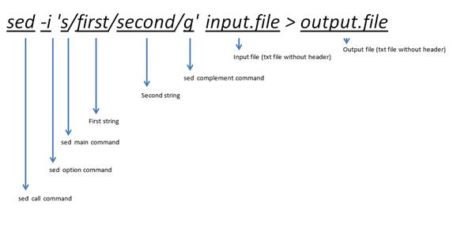

# sed

---



!!! Abstract "内容简介"
    sed 全称 Stream Editor，即流编辑器。想对于 awk 处理每一行中各个字段的列特点，sed 常用于以行为单位的编辑操作，比如字符替换等。

## 1. sed 命令基本逻辑

>sed [选项] ... {脚本} [输入] ...

### 1.1 输入

sed 编辑内容可以是标准输入STDIN，也可以是一个文件。sed 读取内容的一行，放入`模式空间`，并在`模式空间`做命令对应的操作，再将`模式空间`的内容打印到屏幕上

### 1.2 选项

* `-n` 默认sed处理一行就会在STDOUT终端中打印一行。加上`-n`参数就不会在输出端打印。

* `-i` 即sed编辑完后直接储存为源文件，与重定向符号类似`>`（但重定向符号不能覆盖原文件，只会清空）。不过出于数据安全的愿意，建议还是用>重定向到新文件或者保留备份文件比较好。

```bash
# 删除file的空格，保存成file.new文件
$ sed -i 's/ //g' file > file.new
$ ls
file           # 原始文件
file.new       # 新文件

# 删除file的空格，原始文件保存成file.old
$ sed -i.old 's/ //g' file
$ ls
file           # 新文件
file.old       # 原始文件
```

### 1.3 脚本

* `p` 打印行内容

* `l` 打印行内容，包括特殊符号，比如换行符

```bash
# file 文件内容
$ cat file
Hello everyone
my food is great
food is ok
Food
fooooooooooood

# 打印文件第2行
$ sed -n '2p' file
my food is great

# 打印文件第2行到第3行
$ sed -n '2,3p' file
my food is great
food is ok

# 不打印第一行
$ sed -n '1!p' file
my food is great
food is ok
Food
fooooooooooood

# 不打印第2-3行
$ sed -n '2,3!p' file
Hello everyone
Food
fooooooooooood

# 打印文件最后一行, $符号表示文件最后一行
$ sed -n '$p' file
fooooooooooood

# 打印包含"food"字符开始的行
$ sed -n '/^food/p' file
food is ok

# 从第2行开始打印，直到第一个匹配的food打印的那一行为止（不包括第5行）
# 如果没有匹配则一直输出到文件结束
$ sed -n '2,/food/p' file
my food is great
food is ok

# 显示$换行符
$ sed -n '1,3l' file
Hello everyone$
my food is great$
food is ok$
```

* `=` 打印匹配的行号

```bash
# 打印包含fo的行号
$ sed -n '/fo/=' file
2
3
5
```

* `a` 追加行模式

```bash
# 在含fo内容的行后插入一个新行
$ sed '/fo/a\Insert a new line' file
Hello everyone
my food is great
insert a new line
food is ok
insert a new line
Food
fooooooooooood
insert a new line

# 在行尾插入内容
$ sed '$a\The end' file
Hello everyone
my food is great
food is ok
Food
fooooooooooood
The end
```

`i` 插入行模式

```bash
# 在含fo内容的行前插入一个新行
$ sed '/fo/i\Insert a new line' file
Hello everyone
insert a new line
my food is great
insert a new line
food is ok
Food
insert a new line
fooooooooooood

# 在第一行前插入新行
$ sed '1i\Title:food' file
Title:food
Hello everyone
my food is great
food is ok
Food
fooooooooooood
```

`c` 修改模式

```bash
# 含fo的行替换成新的内容
$ sed '/fo/c\changed line content' file
Hello everyone
changed line content
changed line content
Food
changed line content
```

`d` 删除行

```bash
# 删除第一行
$ sed '1d' file
my food is great
food is ok
Food
fooooooooooood

# 删除第2-4行
$ sed '2,4d' file
Hello everyone
fooooooooooood

# 删除匹配 food 的行
$ sed '/food/d' file
Hello everyone
Food
fooooooooooood
```

`s` 替换内容

s 可以算sed中最常用的工具了（想象一下，我们用word处理文本，是不是也经常查找替换！）

!!! note "基本例子"
    ```bash
    # 把pattern1替换为pattern2
    # 首先搜索pattern1，然后将其替换为pattern2
    $ sed s/pattern1/pattern2/flag

    flag:
    ```

`n` 读取下一行，替换当前模式空间
`N` 读取下一行，追加在模1式空间后
`q` 匹配后推出
`r` 读取文本文件，并追加在模式空间后

**执行多个命令**

方法1: -e 参数串联

```bash
# 注意''和""转义时不同，""会把$进行转义，所以打印行尾要用单引号
$ sed -n -e 1"p" -e "2p" -e '$l' file
Hello everyone
my food is great
fooooooooooood$
```

方法2: {;} 命令在大括号里串联使用，用分号分割

```bash
# 注意单双引号区别
$ sed -n "{1p;2p;\$l}" file
$ sed -n '{1p;2p;$l}' file
```

{} 用法更为简便，也更为常用

**保持空间**

保持空间是对模式空间执行命令时的暂存场所，简单将就是提供了一个处理当前行内容时暂存之后，在下一行时再调用回来，或者反之的操作。

`h/H` 保存命令，将模式空间的内容复制/追加到保持空间
`g/G` 取回命令，将保存空间的内容复制/追加到模式空间
`x` 交换命令，将保持空间和模式空间内容互换

```bash
# 将文件倒续排列
$ sed  -e '{1!G;h;$!d}' file
fooooooooooood
Food
food is ok
my food is great
Hello everyone

# 奇数行偶数行互换
$ cat data
1
2
3
4
$ sed -n '{h;n;G;p}' 2
2
1
4
3
# 这条命令的原理是sed先读取第一行到模式空间，因为-n参数所以不会打印显示;然后h命令将第一行复制到保持空间，{}执行多个命令，进入下一个命令n,表示到第二行。然后是命令G，表示将保持空间的第一行内容追加到第二行后。然后命令p打印;接下来读取第三行

# 用 sed 将 fastq 的reads数据转换为fasta数据
$ zcat 1.fastq.gz | sed -n '{s/@/>/g;p;n;p;n;n}' > 1.fasta
```

## 2. 脚本示例

**给序列命名**

```bash
# 在序列test.fas第一行加入序列名称
$ echo "ATCCGAGTTAG" > test.fas
$ sed -i '1i\>seq' test.fas
$ cat test.fa
>seq
ATCCGAGTTAG
```
