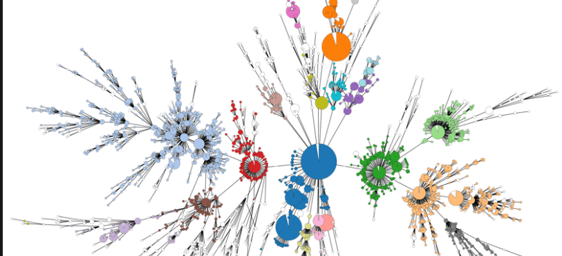

# SRST2

---



!!! Abstract "内容简介"
    [SRST2](https://github.com/katholt/srst2) 采用比对到基因序列的方法来提取如MLST等基因位点的序列，输入数据为测序reads。它自带MLST、耐药基因等数据库，可以获得扫描结果。也提供了工具便于自行建立如毒力基因等特异性为点序列。

## 1. 安装

```bash
# 使用 conda 在虚拟环境 srst2 中安装 SRST2 安装包
$ conda create -n srst2 srst2
$ conda activate srst2

# srst2 是python开发的，也可以用pip安装
(srst2)$ pip install srst2
```

## 2. 使用

!!! warning
    需要注意的是fastq文件名称要符合Miseq命名规范。

```bash
# 下载 MLST 数据库
# 数据库会下载到当前目录
(srst2)$ getmlst.py --species "Vibrio parahaemolyticus"

# 根据测序reads扫描副溶血性弧菌MLST型别
(srst2)$ srst2 --input_pe S1_1.fastq.gz S1_2.fastq.gz --output S1 \
> --log --mlst_db Salmonella_enterica.fasta \
> --mlst_definitions senterica.txt --mlst_delimiter _
```

!!! tip
    对于 --mlst_delimiter 用什么分割符，需要根据具体数据库使用。大部分pubmlst数据库的基因分配号都是用'\_'，其他的一般使用 '-'。具体使用哪个参见 --mlst_db 数据库文件，上面的例子就是 Salmonella_enterica.fasta 文件的序列名称，如果是例如 >abc_1，那么就是下划线。如果是 >abc-1，那么就是破折号。

MLST扫描结果字段：

- Sample：扫描数据的样品名称，比如S1，或者SRR1002045等
- ST：扫描比对数据库后获得ST型别
- 7个具体管家基因：扫描每个基因allele分配的型别
- mismatches：7个管家基因中是否有不匹配的碱基
- uncertainty：由于序列深度或者覆盖度不够造成的不确定情况
- depth：基因比对的覆盖度
- maxMAF：扫描的7个管家基因中最高的minor等位基因频率


根据测序reads获得耐药基因，conda 版本的srst2没有默认的数据库，需要自行下载。srst2 自带的数据库，参见: https://github.com/katholt/srst2/tree/master/data

```bash
(srst2)$ srst2 --input_pe S1_1.fastq.gz S1_2.fastq.gz --gene_db ARGannot_r3.fasta --output S1_result
```

扫描结果直接以tsv格式标注扫描获得的目标基因名称

**自定义基因数据库**

扫描获得基因的有无，构建自定义数据库

```bash
# SRST2可以自定义序列，作为数据库进行比对
# conda 版本的srst2没有自带转换工具，需要自行下载，具体参见：
# https://github.com/katholt/srst2/tree/master/scripts
(srst2)$ conda install cdhit
(srst2)$ cdhit-est -i rawseqs.fasta -o rawseqs_cdhit90 -d 0 > rawseqs_cdhit90.stdout
(srst2)$ cdhit_to_csv.py --cluster_file rawseqs_cdhit90.clstr --infasta raw_sequences.fasta --outfile rawseqs_clustered.csv
# 生成的 seqs_clustered.fasta 可以作为 --gene_db 数据库文件进行扫描
(srst2)$ csv_to_gene_db.py -t rawseqs_clustered.csv -o seqs_clustered.fasta -f rawseqs.fasta -c 4
```

扫描基因的不同型别，构建自定义数据库

```bash
# 基因型别数据库的序列要用这种格式命名，具体可以参考耐药数据库的序列内容
>[clusterUniqueIdentifier]__[clusterSymbol]__[alleleSymbol]__[alleleUniqueIdentifier]
```

## 3. 分析示例

### 3.1 获得分析数据

下载 Bacillus anthracis SRA 数据库miseq测序平台的基因组测序数据。

```bash
# edirect 工具生成 sra 的 runinfo 信息列表
# 过滤了测序数据过小和平均读长过小的数据
$ esearch -query '"Bacillus anthracis"[Organism] AND \
> "miseq"[All Fields] AND ("biomol dna"[Properties] AND \
> "strategy wgs"[Properties])' -db sra | efetch -format runinfo \
> -db sra | awk '/^[SDE]RR/' | awk -F',' '{if($8>150  && $16=="PAIRED" && $20 =="Illumina MiSeq") print $1}' | prefetch -v
```

### 3.2 生成fastq数据

将 SRA 格式的数据转换成 fastq 格式。

```bash
# 批量转化成 fastq.gz 格式文件
$ parallel "fastq-dump --split-files --gzip --outdir fastq" ::: *.sra
# 确认数据均是 paired end 测序，如果有 single end，将其分离到不同的目录中
$ ls -l *.fastq.gz | awk -F'_' '{print $1}' | awk '{print $9}' | uniq -u
# 输出的编号即为非 paired end 测序数据。

# bioawk 统计GC含量分布
$ parallel "bioawk -c fastx 'BEGIN{n=0;q=0}{n+=gc(\$seq);q+=meanqual(\$seq)}END{print \$name,n/NR,q/NR}' \
> >> gc_result.txt" ::: *.fastq.gz
```

### 3.3 扫描数据

srst2 对数据进行扫描，获得MLST型别，毒力基因

```bash
# 准备目录结构
$ mkdir -p mlst vfdb ardb result

# 准备 MLST 数据库，将下载的文件放入 mlst 目录内
# 由于 B. anthracis 没有公共 MLST 数据库，这里用近源的 B. cereus MLST 数据库
# 数据来分析 B. anthracis
$ getmlst.py --species "Bacillus cereus"

# 准备毒力基因数据文件，将文件放入 vfdb 目录中
$ cd vfdb
$ wget http://www.mgc.ac.cn/VFs/Down/VFDB_setB_nt.fas.gz
$ gunzip VFDB_setB_nt.fas.gz
$ python path/srst2/database_clustering/VFDBgenus.py --inflie VFDB_setB_nt.fas --genus Bacillus
$ cd-hit -i Bacillus.fsa -o Bacillus_cdhit90 -c 0.9 > Bacillus_cdhit90.stdout
$ python path/srst2/database_clustering/VFDB_cdhit_to_csv.py --cluster_file Bacillus_cdhit90.clstr \
> --infile Bacillus.fsa --outfile Bacillus_cdhit90.csv
$ python path/srst2/database_clustering/csv_to_gene_db.py -t Bacillus_cdhit90.csv \
> -o Bacillus_VF_clustered.fasta -s 5

# 批量处理
$ for i in $(ls *.fastq.gz | awk -F'_' '{print $1}' | uniq); do srst2 \
> --input_pe ${i}_1.fastq.gz ${i}_2.fastq.gz \
> --mlst_db ../mlst/Bacillus_cereus.fasta \
> --mlst_definitions ../mlst/bcereus.txt \
> --mlst_delimiter _ \
> --gene_db Bacillus_VF_clustered.fasta \
> --log --threads 40 --output ../result; \
> done

# 耐药基因分析
$ for i in $(ls *.fastq.gz | awk -F'_' '{print $1}' | uniq); do srst2 \
> --input_pe ${i}_1.fastq.gz ${i}_2.fastq.gz \
> --log --output ../result \
> --gene_db path/srst2/datab/ARGannot.r1.fasta; \
> done
```

## 参考资料

1. srst2: https://github.com/katholt/srst2#gene-databases
