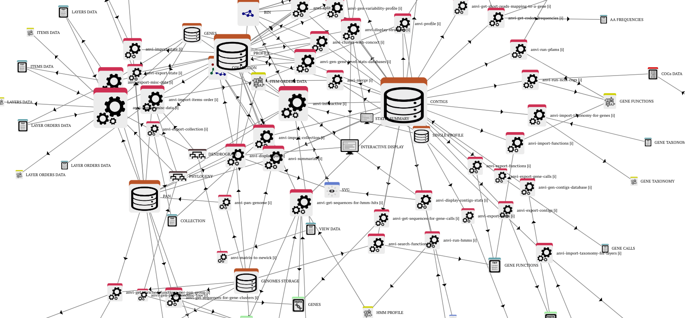

# Anvi'o

---



!!! Abstract "内容简介"
    Anvi'o 是一个整合的B/S工具


## 1. 安装

Archlinux 安装 v5.5 版本的 anvio

```bash
$ sudo pacman -Syu
$ sudo pacman -S blas cblas lapack

```


## 参考资料

- [Anvi'o 官方网站](http://merenlab.org/software/anvio/)
