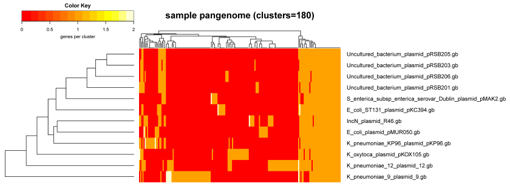

# get_homologues 分析 Pangenomes



[get_homologues](http://eead-csic-compbio.github.io/get_homologues) 是一个用 perl 语言编写的用来鉴定细菌 core-genomes 和 pan-genomes 的开源工具。

## 安装

```bash
# 当前最新版本为 v3.1.2
$ wget https://github.com/eead-csic-compbio/get_homologues/releases/download/v3.1.2/get_homologues-x86_64-20180524.tgz
$ tar zxf get_homologues-x86_64-20180524.tgz -C get_homologues
$ cd get_homologues

# 新建一个虚拟环境
$ conda create -n get_homologues
$ conda activate get_homologues

# 安装 gd 依赖
(get_homologues)$ conda install perl-gd
# 如果没有安装 R，可以在虚拟环境里安装 r-base
(get_homologues)$ conda install r-base

# 下载 pfam 和 swissprot 数据库
(get_homologues)$ wget -P db/  ftp://ftp.uniprot.org//pub/databases/uniprot/current_release/knowledgebase/complete/uniprot_sprot.fasta.gz
(get_homologues)$ wget -P db/  ftp://ftp.ebi.ac.uk/pub/databases/Pfam/current_release/Pfam-A.hmm.gz

# 安装
(get_homologues)$ ./install.pl
```

## 使用

我们以 Bacillus cereus 基因组 assembly 数据库为例分析该物种的 Pangenomics。

```bash
# 抓取 gbk 格式的 assembly 文件在 NCBI FTP 上的下载路径
$ esearch -db assembly -query "Bacillus cereus[ORGN] AND latest[SB]" | \
> efetch -format docsum | \
> xtract -pattern DocumentSummary -element FtpPath_RefSeq | \
> awk -F"/" '{print $0"/"$NF"_genomic.gbff.gz"}' > bcereus.path

# 用 wget 工具下载
$ wget --limit-rate 300k --no-passive-ftp -i bcereus.path

# get_homologues 分析
$ get_homologues.pl -d . -n 40
```

get_homologues 可以默认使用 blast 进行序列相似性搜索，为了加快速度，也可以使用 diamond。

```bash
# -X 调用 diamond 进行序列相似性搜索
$ get_homologues.pl -d gbk_folder -n 40 -X
```


## Reference

1. Bacterial Pangenomics, Methods and Protocols, Chapter14
2. [get_homologues manual](http://eead-csic-compbio.github.io/get_homologues/manual/manual.html)
